## Incoming call flow — rsip-wrapper + mod_rsip + FreeSWITCH

The diagram below shows the flow for an incoming SIP INVITE when using the `rsip-wrapper` hybrid stack. It highlights the Rust-side listener and parser, the C shim (e.g., `mod_rsip`) which receives events via the FFI callback, and the FreeSWITCH core that creates sessions and handles media.

```mermaid
flowchart LR
  %% External UA and network
  UA[User Agent SIP endpoint] -->|SIP INVITE| RSIP_WRAPPER[rsip-wrapper UDP/TCP/WS listener]

  %% Rust-side processing
  RSIP_WRAPPER -->|raw SIP bytes| RSIP_PARSER[rsip parser/types]
  RSIP_PARSER -->|event: INVITE parsed| MOD_RSIP[mod_rsip c callback]

  %% C-shim translates events into FreeSWITCH API calls
  MOD_RSIP -->|create session / new channel| FS_CORE[FreeSWITCH core switch_core_session_*]
  MOD_RSIP -->|deliver remote SDP| FS_SDP[switch_sdp]

  %% FreeSWITCH negotiates and attaches media
  FS_CORE -->|generate local SDP| FS_SDP
  FS_CORE -->|attach media| FS_MEDIA[Media Engine / RTP]
  FS_MEDIA -->|RTP audio/video| UA

  %% Signaling back to UA
  MOD_RSIP -->|invoke rsip_send_udp / send response| RSIP_WRAPPER
  RSIP_WRAPPER -->|SIP 100/180/200/ACK| UA

  %% Mid-call and teardown
  UA -->|ACK / in-dialog requests| RSIP_WRAPPER
  RSIP_WRAPPER --> MOD_RSIP
  UA -->|BYE| RSIP_WRAPPER
  RSIP_WRAPPER --> MOD_RSIP
  MOD_RSIP -->|call hangup| FS_CORE
  FS_CORE -->|release media| FS_MEDIA

  %% Grouping boxes
  subgraph Rust
    RSIP_WRAPPER
    RSIP_PARSER
  end

  subgraph C_Module
    MOD_RSIP
  end

  subgraph FreeSWITCH
    FS_CORE
    FS_SDP
    FS_MEDIA
  end

  classDef rustfill fill:#E8F1FF,stroke:#5B9BD5;
  classDef cfill fill:#FFF4E5,stroke:#E69F00;
  classDef fsfill fill:#E8FFE8,stroke:#2E8B57;
  class RSIP_WRAPPER,RSIP_PARSER rustfill;
  class MOD_RSIP cfill;
  class FS_CORE,FS_SDP,FS_MEDIA fsfill;

``` 

Notes
- The prototype `rsip-wrapper` currently forwards raw SIP datagrams to the C callback; extend `RSIP_PARSER` to emit higher-level events (INVITE/REGISTER/BYE) if desired.
- In an in-process FreeSWITCH module, callbacks from Rust should be marshalled onto FS worker threads before calling core APIs.
- Media (RTP) is typically handled by FreeSWITCH; the diagram assumes FS will terminate or proxy media and negotiate SDP with the remote UA.
